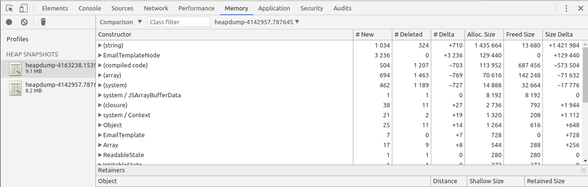
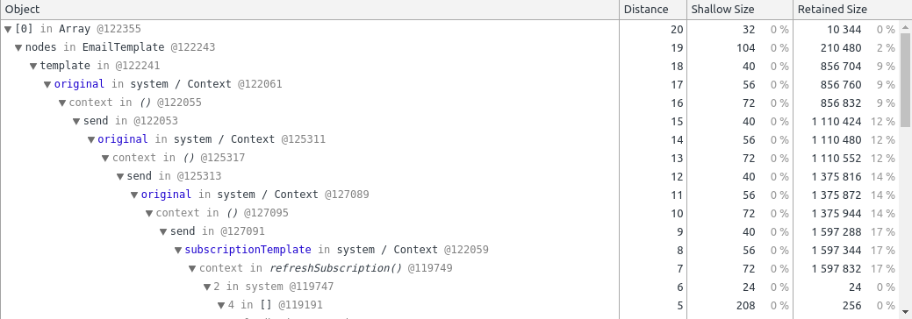

### Node Memory Leak Analysis

In this lab, you will experiment with Node memory leak analysis. Although V8 is a managed, garbage-collected runtime, memory leaks are still possible due to JavaScript references (undesired object retention) and unmanaged memory allocations in C++ modules. Tracking memory leaks requires discipline, monitoring, heap snapshots, and careful diff analysis.

- - -

#### Task 1: Run the Leaking Application

Navigate to the `nodey` directory. If you haven't yet, you should make sure all required packages are installed by running `npm install`. Then, run the following command to start our simple Node application:

```
$ ./run.sh
```

In another shell, run `top -p $(pgrep -n node)` to monitor Node's memory usage. In the original shell, run the following command to start a background subscription notification component in the Node service:

```
$ curl -X POST http://localhost:3000/users/subscribe
```

The application's memory usage starts going up at an alarming rate of multiple hundred kilobytes per second; this looks like a memory leak!

- - -

#### Task 2: Grab Memory Snapshots with `llnode`

We can now attach to the Node process and grab snapshots of its heap memory. At the very least, we should like to see the number of objects of different types -- this will help point the investigation in the right direction. To do so, we will use `llnode`: the `llnode` plugin can be installed separately using `npm install -g llnode`; in the instructor-provided VM, it will be in `~/tracing-workshop/node_modules/.bin/llnode`. 

> There are two modes of operation we could follow here. One option is attaching LLDB to the Node process repeatedly (say, every few minutes/hours), and grabbing a list of types and the number of objects of each type. This causes a temporary suspension of the service's operation, which is potentially unbounded if the heap is very large. The other option is to create a core dump of the Node process and use LLDB to open the core dump. This minimizes the suspension time (the process
> is only suspended during the creation of the core dump), but requires disk space for the core dump. We will use the latter approach, as it is somewhat safer for production use.

Run the following command to generate a core dump of the Node process, and then load that core dump into LLDB, loading the `llnode` plugin at the same time:

```
$ gcore -o core $(pgrep -n node)
$ ~/tracing-workshop/node_modules/.bin/llnode -c core.1234
```

The `llnode` plugin provides multiple commands for inspecting the state of the V8 runtime. You can see a full list by typing `v8`. For now, the command you'll need is `v8 findjsobjects`, which dumps out a summary of which types are on the V8 heap, how many instances there are of each type, and the total amount of memory consumed by these instances.

> If you're familiar with heap snapshot analysis lingo, referring to the size of an object may sound ambiguous. The `v8 findjsobjects` command reports the _shallow_ size of the object, which does not include outgoing references. There is no `llnode` command which reports the _retained_ size of the object, which includes the full object graph referred to by the properties of that object. To perform retained size analysis, you'll need a heap snapshot with the Chrome Developer Tools,
> discussed later.

Repeat the above workflow (generating a core dump, loading it into LLDB, and looking at the top types with `v8 findjsobjects`) 2-3 times, until you get a clear view of which object types are growing in the V8 heap.

- - -

#### Task 3: Analyze Object References from a Core Dump

Now that you know that there are many strings, `EmailTemplateNode`, and `EmailTemplate` objects being created by the application and not being released, you can try to figure out what's keeping them in memory. Doing so with `llnode` is not easy, but is sometimes the only resort if you're on a production system, or if you have only a core dump to work with (e.g., if the application crashed due to memory exhaustion).

Use `llnode` to open one of the core dumps generated in the previous task:

```
$ ~/tracing-workshop/node_modules/.bin/llnode -c core.1234
```

Run the following commands to get a list of interesting instances:

```
(lldb) v8 findjsinstances EmailTemplateNode
(lldb) v8 findjsinstances EmailTemplate
```

Each of these commands should produce a long list of instances; you can inspect individual instances by using the `v8 inspect` command, passing it the object's address. Another powerful facility that can help explain why an inidividual instance is kept in memory is the `v8 findrefs` command (again, it takes the object address as an argument). Try using these commands with a few object instances and see if you can see a pattern that maps somehow to the application's source code.
(To get help on the `llnode` command functionality, simply type `v8`.)

- - -

#### Task 4: Generate Heap Snapshots from `heapdump`

As you see, working with `llnode` to analyze V8 memory leaks is quite painful. You can only look at individual objects (there are no summaries), there's no way to see the retained size of an object, and the whole experience relies on a text-based interface, which is often unusable when there is a very large number of objects and types.

Open the [app.js](nodey/app.js) file, and add the following line in the requires section:

```javascript
var heapdump = require('heapdump');
```

The [heapdump](https://github.com/bnoordhuis/node-heapdump) module adds a background agent to your process, which provides two distinct services:

* An API that you can use to create heap snapshots directly, on demand (`heapdump.writeSnapshot`)
* A signal handler that you can invoke externally by sending the `SIGUSR2` signal to the process

Run `npm install --save heapdump` to get the `heapdump` module, and then run the application again:

```
$ ./run.sh
```

Issue the following command to begin the leaking process again:

```
$ curl -X POST http://localhost:3000/users/subscribe
```

Finally, at 5-10 second intervals, run the following command a few times to send the `SIGUSR2` signal to the process and generate a heap snapshot:

```
$ kill -USR2 $(pgrep -n node)
```

The heap snapshots will be generated in the `nodey` directory. After the snapshots are generated, you don't need the original process anymore -- it can be terminated to conserve memory (e.g. `pkill node` would do the trick).

- - -

#### Task 5: Analyze the Heap Snapshots in Chrome Developer Tools

To open the heap snapshots generated in the previous task, you will need Chrome Developer Tools. Open Chrome, hit F12 to open the Developer Tools, navigate to the Profiles tab or the Memory tab (depending on your version of Chrome), and load the heap snapshots one by one. Each snapshot will contain a summary of objects by type, general statistics, and a compare feature that diffs two snapshots and shows which objects were newly retained between two snapshots.



If you click an individual object, the lower pane will show the retention chain for that objects -- a list of references keeping that object alive. For example, here's the chain of references for one of the `EmailTemplateNode` objects resident on the heap:



This memory leak is not at all trivial to diagnose. Even when you understand the chain of references and figure out the source location (`refreshSubscription` in [users.js](nodey/users.js)) where you should look, the cause of the bug is quite subtle. When there are two closures in the same scope, the V8 runtime "optimizes" the closure context by sharing a closure context between both closures. As a result, if one of the closures retains a variable, the other closure retains it as well.
This specific bug was originally described by Meteor developers in [this blog post from 2013](https://blog.meteor.com/an-interesting-kind-of-javascript-memory-leak-8b47d2e7f156).

- - -

#### Bonus

Node has some additional features that make it slightly easier to diagnose memory leaks. If you have time, you can explore them by using them with the `nodey` application:

* The [`node-memwatch`](https://github.com/marcominetti/node-memwatch) module provides leak detection for Node applications. It monitors the heap state after a GC occurs, and identifies situations in which the heap size is growing over more than 5 consecutive collections. It even reports the estimated leak velocity (MB per hour).

* The [`v8-profiler`](https://github.com/node-inspector/v8-profiler) module provides a JavaScript interface to the heap snapshots API, and helps you capture snapshots programmatically. Most of its capabilities are actually available in the `heapdump` module we used above, but it has more low-level facilities.

* [`node-inspector`](https://github.com/node-inspector/node-inspector), and [in recent Node versions](https://medium.com/@paul_irish/debugging-node-js-nightlies-with-chrome-devtools-7c4a1b95ae27), the Chrome `about:inspect` page, can direct you to the Node DevTools experience, in which you can capture heap snapshots directly. However, this requires running Node with `--inspect` (or `--debug` in older versions), which is not always suitable for production use.

- - -

